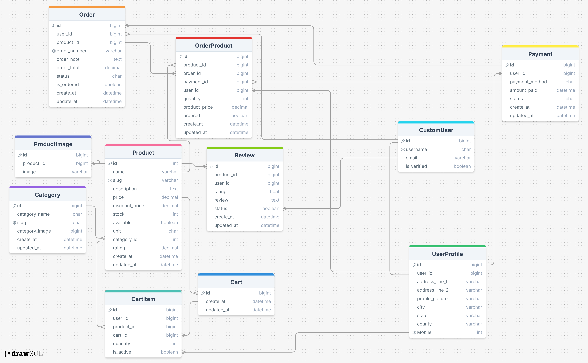

# OSTAD-Course-SingleVendorECommerceProject  

## Overview  
This project is a **Single Vendor E-Commerce Platform** that allows users to browse products, register/login, add items to the cart, and complete purchases using the **SSLCommerz payment gateway**.  

## Features & Functionalities  

### 🏠 Home Page  
- **Navbar**: Links to Home, Cart, Login/Register  
- **Carousel**: Displays promotional banners & featured products  
- **Product Card Section**:  
  - Product Name & Description with a details page  
  - Old & New Price Tag  
  - New Arrival Tag  
  - SSLCommerz Payment Gateway Integration  
- **Footer**:  
  - Contact Information  
  - Social Media Links  
  - Terms & Conditions / Privacy Policy  

### 🔑 Authentication System  
- **Login / Register Page**  
  - **New User Registration:**  
    - Register using Email & Password  
    - Signup with Google  
    - Email Verification Required for Activation  
  - **Existing User Login:**  
    - Login via Email & Password  
    - Login with Google  

### 🎛️ User & Admin Dashboards  
#### 👤 Admin Profile & Dashboard  
- Edit / Update Profile Information  
- **Product Management Section:**  
  - Add, Edit, Delete Products  
  - Manage all Product Reviews  
  - View all Sales & Purchase History  

#### 🛍️ User Profile & Dashboard  
- Edit / Update Profile Information  
- Product Review Section  
- Purchase History Section  

---

### 📌 Technologies Used  
- **Frontend:** HTML, CSS, JavaScript  
- **Backend:** Python Django  
- **Database:** PostgreSQL / SQLite  
- **Payment Gateway:** SSLCommerz  

